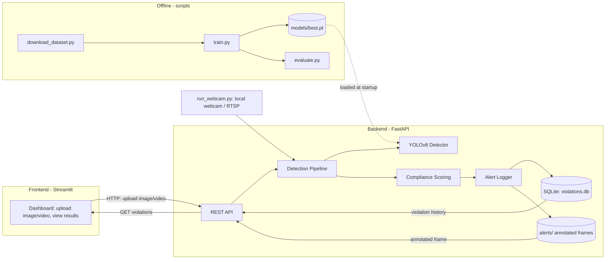
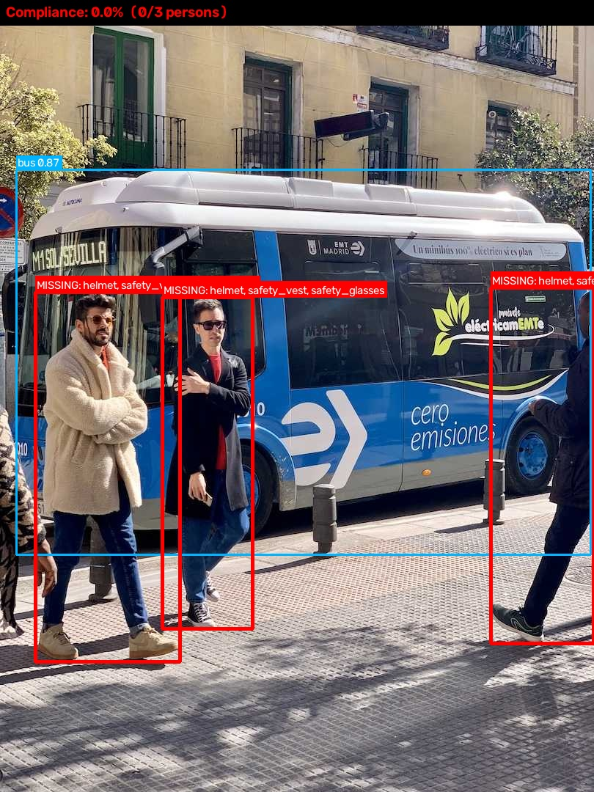

# PPE-Safety-Vision

Real-time Personal Protective Equipment (PPE) detection system. It
identifies whether workers in an image, video, or live camera stream
are wearing required safety gear (helmet, safety vest, safety
glasses), computes a per-frame compliance score, and logs a violation
whenever a worker is found non-compliant.

## Motivation

Manual PPE compliance checks on construction sites, factories and
warehouses are slow, inconsistent, and impossible to run continuously.
A camera-based detector that scores compliance automatically and keeps
an auditable log of violations gives safety teams real-time visibility
without needing a person watching every feed.

## Features

- YOLOv8 (Ultralytics) object detector fine-tuned on a public PPE
  dataset, with a fallback to stock COCO weights so the whole pipeline
  is runnable even before training.
- Three input modes: single image, video file, and webcam/RTSP stream.
- Per-frame compliance scoring: each detected person is matched
  against required gear and marked compliant or non-compliant.
- Automatic violation logging: annotated frame saved to `backend/alerts/`
  and a timestamped record inserted into a SQLite database.
- FastAPI backend exposing inference and violation-history endpoints.
- Streamlit dashboard for uploading media and browsing results.
- Training, dataset-download, and evaluation scripts, with a
  README-ready metrics table and result artifacts.

## Architecture



The frontend never runs detection itself; it is a thin HTTP client
over the backend API. The backend owns the model, the compliance
logic, the alert log, and the database.

## Repository structure

```
PPE-Safety-Vision/
├── backend/            FastAPI service, detection pipeline, training/eval scripts
├── frontend/           Streamlit dashboard
├── docs/               Generated evaluation report (results.md, metrics.json)
├── assets/             Sample prediction images, confusion matrix, demo GIF
├── notebooks/          Dataset exploration notebook
├── LICENSE
└── README.md
```

See [backend/README.md](backend/README.md) and
[frontend/README.md](frontend/README.md) for component-level details.

## Dataset

The training pipeline targets public PPE detection datasets exported
in YOLO format, most easily obtained from Roboflow Universe (for
example the "Construction Site Safety" dataset family, which ships
classes like `Hardhat` / `NO-Hardhat` / `Safety Vest` / `NO-Safety
Vest`). `backend/scripts/download_dataset.py` automates fetching such
a dataset via the Roboflow API (a free API key is required) or a raw
Kaggle dataset via the Kaggle API.

This project uses its own normalized class schema so the compliance
logic is dataset-agnostic:

| Class | Meaning |
|---|---|
| `person` | A detected worker |
| `helmet` / `no_helmet` | Hardhat worn / explicitly absent |
| `safety_vest` / `no_safety_vest` | Hi-vis vest worn / explicitly absent |
| `safety_glasses` / `no_safety_glasses` | Eye protection worn / explicitly absent |

If your chosen dataset uses different class names, update
`CLASS_NAMES` and `REQUIRED_GEAR` in
[backend/app/config.py](backend/app/config.py) to match.

## Installation

### Backend

```bash
cd backend
python -m venv .venv
.venv\Scripts\activate        # Windows
# source .venv/bin/activate   # macOS / Linux
pip install -r requirements.txt
uvicorn app.main:app --reload --port 8000
```

The API is now live at `http://localhost:8000` (interactive docs at
`/docs`). See [backend/README.md](backend/README.md) for the full
endpoint list and the training/evaluation pipeline.

### Frontend

```bash
cd frontend
python -m venv .venv
.venv\Scripts\activate        # Windows
# source .venv/bin/activate   # macOS / Linux
pip install -r requirements.txt
streamlit run app.py
```

The dashboard opens at `http://localhost:8501` and talks to the
backend at `http://localhost:8000` by default (configurable in the
sidebar).

## Usage examples

### 1. Single image (via API)

```bash
curl -X POST "http://localhost:8000/api/v1/infer/image" \
     -F "file=@sample.jpg"
```

Returns detections, per-person compliance, the frame compliance score,
a base64-encoded annotated image, and a violation id if logged.

### 2. Video file (via API)

```bash
curl -X POST "http://localhost:8000/api/v1/infer/video" \
     -F "file=@sample_clip.mp4"
```

Returns the number of frames processed, the average compliance score,
how many violations were logged, and the server-side path of the
annotated output video. Frames are sampled (`VIDEO_FRAME_SAMPLE_RATE`
in `backend/app/config.py`) to keep CPU-only inference tractable.

### 3. Webcam / RTSP stream (local script)

```bash
cd backend
python scripts/run_webcam.py --source 0
python scripts/run_webcam.py --source rtsp://camera-ip/stream
```

Opens a live annotated window and logs violations continuously through
the same alerting pipeline the API uses.

### Dashboard

Instead of curl, the same image and video workflows are available
through the Streamlit dashboard's Image and Video tabs, with a third
Violations tab for browsing the logged history.

## Results

No custom PPE weights have been trained in this repository snapshot,
so no PPE-specific mAP/precision/recall numbers are reported here yet.
Running the training pipeline (see [backend/README.md](backend/README.md))
regenerates [docs/results.md](docs/results.md) with real numbers in
this format:

| Class | Precision | Recall | mAP@0.5 | mAP@0.5:0.95 |
|---|---|---|---|---|
| All (overall) | - | - | - | - |
| helmet | - | - | - | - |
| no_helmet | - | - | - | - |
| safety_vest | - | - | - | - |
| no_safety_vest | - | - | - | - |
| safety_glasses | - | - | - | - |
| no_safety_glasses | - | - | - | - |

`backend/scripts/evaluate.py` also saves a confusion matrix, a PR
curve, and sample annotated prediction images to
`assets/sample_predictions/`, which belong here once training has run.

### Pipeline smoke test

The image below is a real, unedited output of this repository's
detection -> compliance -> visualization code
(`backend/app/core/pipeline.py`), run with the stock `yolov8n.pt` COCO
fallback checkpoint (no PPE training yet). It confirms the pipeline
works end to end: people are detected, matched against required gear,
and flagged non-compliant because a COCO model has no notion of
helmets or vests.



*Fallback COCO weights correctly detect 3 persons and flag all 3 as
non-compliant (0% compliance) since helmet/vest/glasses classes do not
exist in COCO. Real PPE classification requires the trained weights
produced by `scripts/train.py`.*

A demo GIF of the video pipeline belongs in `assets/demo/` once a
sample clip has been run through `scripts/evaluate.py` or the video
API endpoint.

## Limitations and future work

- No PPE-specific weights are bundled; the model must be trained by
  the user via `backend/scripts/download_dataset.py` and `train.py`.
- Person-to-gear association uses a bounding-box overlap heuristic
  (`GEAR_MATCH_OVERLAP` in `backend/app/config.py`), not pose
  estimation or tracking; it can misassign gear in dense crowds or
  heavy occlusion.
- Video processing samples frames rather than running on every frame,
  trading temporal resolution for CPU-only throughput.
- The RTSP/webcam path is a local script, not yet exposed as a
  managed, restartable background job through the API.
- No authentication or multi-tenant camera management; this is a
  single-operator research/demo project, not production
  infrastructure.
- Alerting is limited to logging (image + database row); no
  email/webhook/SMS notification channel is wired up yet.

## License

Released under the [MIT License](LICENSE).
